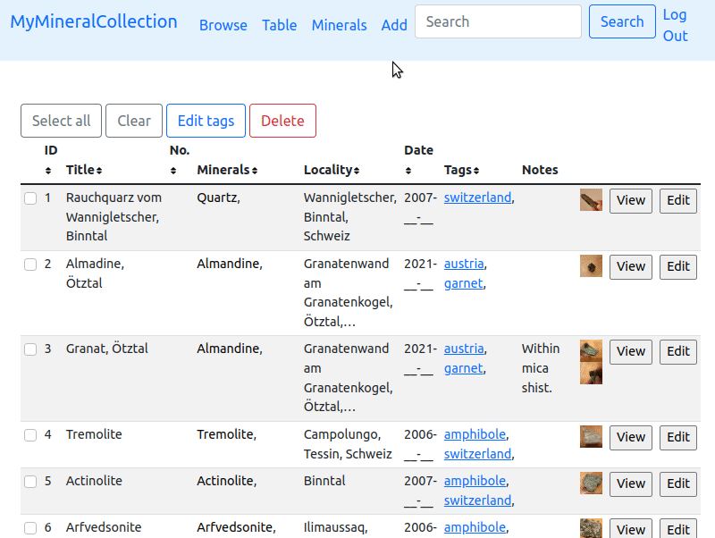
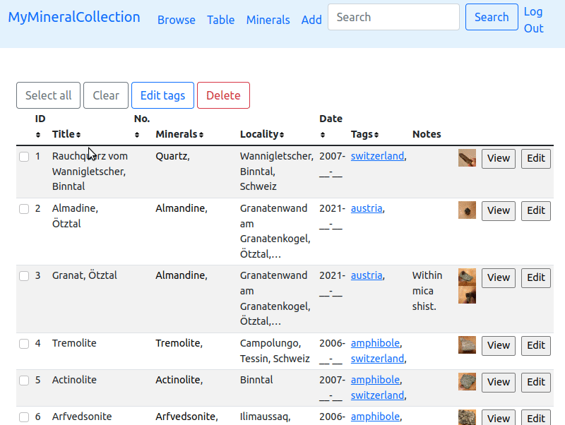
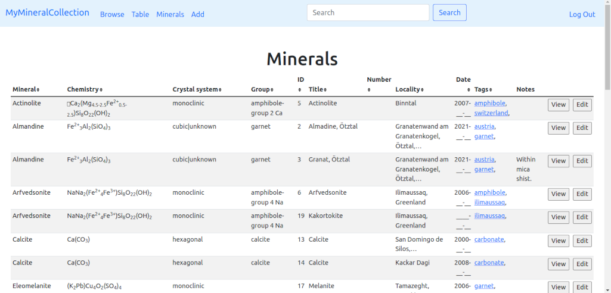
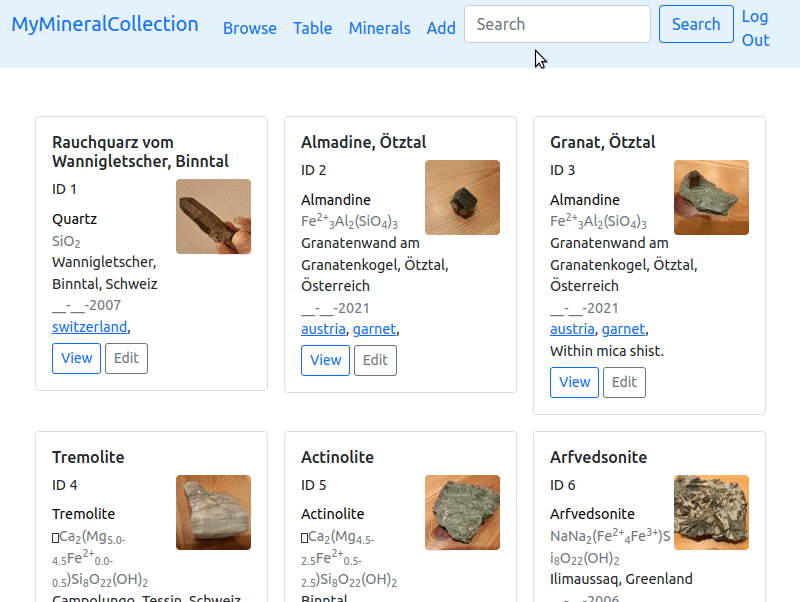

# Mymineralcollection (CS50 final project)
Mymineralcollection is a webapp for mineral collectors using python, flask, sqlite and javascript. It is my final project of the [CS50 Introduction to Computer Science](https://www.edx.org/cs50) online course from Harvard / edx. 


This app allows registered users to manage, browse and search their mineral collection. It uses a database table with (almost) all IMA approved minerals (data from from [https://rruff.info/ima/](https://rruff.info/ima/)) to show chemistry, crystal system etc. of the minerals.

## Usage

### Add and edit specimen



Adding [official mineral names](https://mineralogy-ima.org/Minlist.htm) to a specimen record is easy thanks to autocomplete (inspired by the [AJAX example](https://cs50.harvard.edu/x/2022/weeks/8/) of CS50). If the title field is left empty, a title is automatically generated with the selected minerals. One or several photos per specimen can be uploaded. The edit form is identical to the add form, but filled with data from the database. 

### Tables



In the table view it is possible to bulk edit the tags of several selected specimen. It is also possible to delete several specimen in one go. By clicking on the table header on top of a certain column, the table can be sorted in ascending and descending order. 



Since one specimen can contain several minerals, sorting the specimen table by minerals is problematic. This is solved by a second table showing all minerals (specimen with n minerals are listed n times). Also chemistry, crystal system etc. are shown. 

### Browse and view specimen

The view of a specimen shows all avaible data and images. For all minerals, chemistry and crystal system etc. are automatically shown. If several images are present, they are shown in a slideshow. 



Clicking "Browse" shows the browser view with all specimen. Clicking on tags or mineral names anywhere in the app (browser, table, specimen view) shows the filtered specimen in the browser. The layout of cards is responsive to the window size and also works well on mobile phones.

Also search results are shown in the browser. A search is performed on most database columns – unfortunately not on tags (in the current versions). 

### Login and Register
The login and register functionality and session management were taken from [CS50s finance problem set](https://cs50.harvard.edu/x/2022/psets/9/finance/).

## Youtube video
(https://www.youtube.com/watch?v=1QHAHcz1RTY)[https://www.youtube.com/watch?v=1QHAHcz1RTY]

## Requirements
- cs50
- Flask
- Flask-Session
- PIL
- sqlite3

## Create Database
A clean database should be included in the repository.

If the database mineralcollection.db does not exist, it can be created with the script `createdb.py`. A CSV file with mineral data is required that can be downloaded from [https://rruff.info/ima/](https://rruff.info/ima/). Be sure to include "Mineral Name (plain)", "Chrystal Systems", "IMA Chemistry (HTML)", "Chemical Elements", "Fleischers Groupname", "IMA Mineral Symbol" in your export options and save the file as minerals.csv. Note that some newly approved minerals that don't have a offical IMA symbol yet are skipped.

The "uploads" folder must have access permission 777.

## Database scheme
The database uses 6 tables:
- minerals
- users
- specimen
- specmin
- tags
- images

The specimen table contains the data of the mineral specimen. Since one specimen can contain several minerals, the table specmin is needed to link specimen to minerals. The minerals table contains the mineral data of all approved minerals. It uses the official IMA mineral symbol as primary key, in order to allow updates of the mineral data without breaking database relations.

The database scheme is:

``` sql
CREATE TABLE minerals (
    symbol TEXT, 
    name TEXT NOT NULL, 
    chemistry TEXT, 
    elements TEXT, 
    crystal_system TEXT, 
    fleischer TEXT, P
    RIMARY KEY(symbol));
CREATE TABLE users (
    id INTEGER PRIMARY KEY AUTOINCREMENT NOT NULL, 
    username TEXT NOT NULL, 
    hash TEXT NOT NULL);
CREATE TABLE sqlite_sequence(name,seq);
CREATE UNIQUE INDEX usernameidx ON users (username);
CREATE TABLE specimen (
    id INTEGER PRIMARY KEY AUTOINCREMENT NOT NULL, 
    user_id INTEGER NOT NULL, 
    my_id TEXT, 
    title TEXT, 
    locality TEXT, 
    day INTEGER, 
    month INTEGER, 
    year INTEGER, 
    notes TEXT, 
    thumbnail TEXT);
CREATE INDEX yearidx ON specimen (year);
CREATE TABLE specmin (
    specimen_id INTEGER NOT NULL REFERENCES specimen(id) ON DELETE CASCADE, 
    min_symbol TEXT NOT NULL, FOREIGN KEY(min_symbol) REFERENCES minerals(symbol));
CREATE TABLE tags (
    specimen_id INTEGER NOT NULL REFERENCES specimen(id) ON DELETE CASCADE, 
    tag TEXT NOT NULL);
CREATE INDEX tagidx ON tags (tag);
CREATE TABLE images (
    specimen_id INTEGER NOT NULL REFERENCES specimen(id) ON DELETE CASCADE, 
    file TEXT NOT NULL);
```

Note that the column "thumbnail" is not used in the current version of Mymineralcollection.

## Ideas for improvement
A one week project can't be perfect. Future work could include:
- Search also on tags.
- Port DB handling from cs50 to sqlAlchemy. 
- Print labels for selected specimen.
- Optionally print these labels with QR codes of the URL of the specimen.
- If several images were added to a specimen, allow to chose one as default thumbnail. 
- Improve the layout of the edit/add forms.
- Allow changing the sort order in the browser view (not only in the tables).
- Allow changing password and to delete the user.

